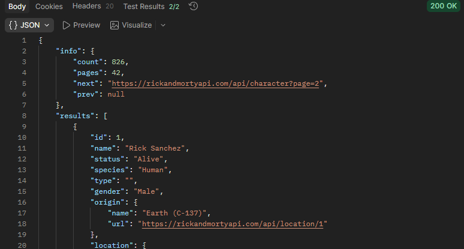
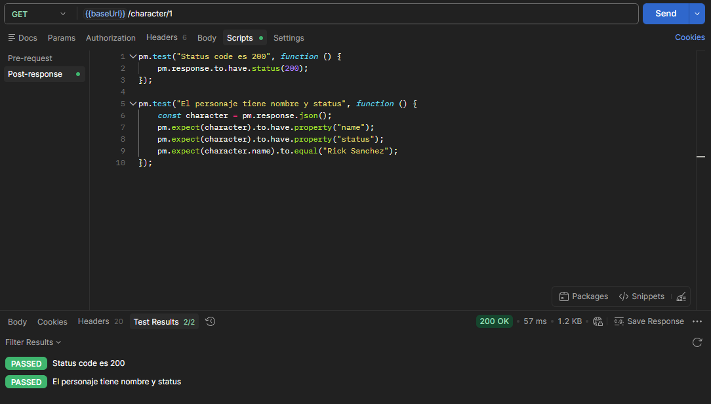

# Laboratorio API — Rick and Morty

## ¿Qué API elegí y por qué?
Elegí Rick and Morty API porque no requiere token, tiene varios tipos de recursos (personajes, episodios, ubicaciones) y es perfecta para practicar.

## ¿Qué datos devuelve?
Devuelve tres tipos de recursos:
- **Personajes**: nombre, especie, status (alive/dead/unknown), origen...
- **Episodios**: nombre, fecha, código de temporada...
- **Ubicaciones**: nombre, tipo, dimensión...

## ¿Usa token?
No requiere autenticación. Es una API pública y abierta.

## Códigos de estado recibidos
| Request | Endpoint | Código |
|---|---|---|
| GET todos los personajes | /character | 200 OK |
| GET personaje por ID | /character/1 | 200 OK |
| GET personaje inexistente | /character/99999 | 404 Not Found |
| GET filtro por nombre | /character?name=rick | 200 OK |
| GET episodios | /episode | 200 OK |
| GET ubicaciones | /location | 200 OK |

## ¿Qué aprendí diferente a JSONPlaceholder?
- La paginación: esta API devuelve los datos en páginas.
- La estructura de respuesta tiene un objeto "info" con metadatos.
- JSONPlaceholder simulaba operaciones POST/PUT/DELETE, esta es solo lectura.

## Capturas

**GET todos los personajes**

**GET todos los personajes**

**Tests GET personaje por ID**

