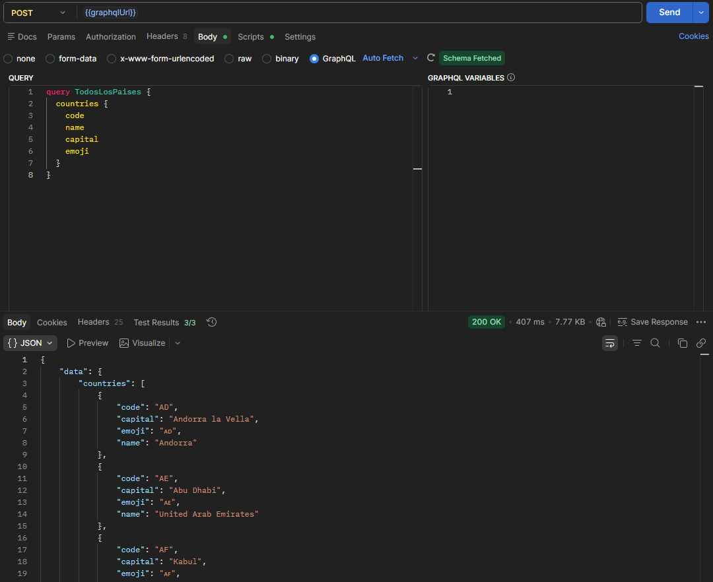
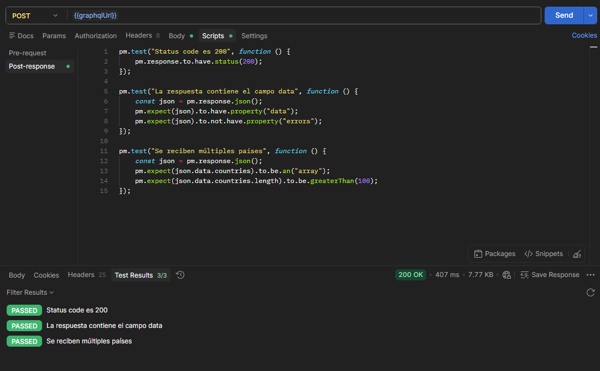
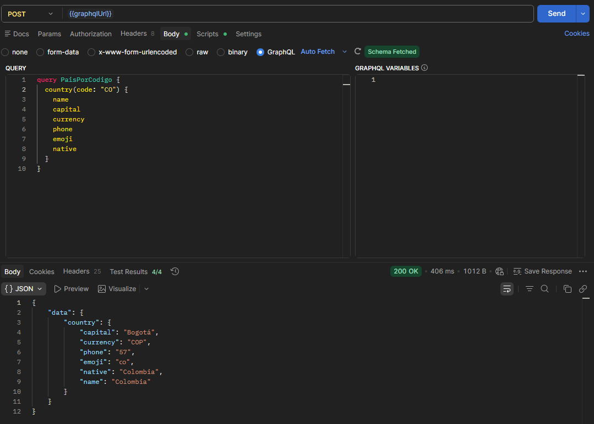
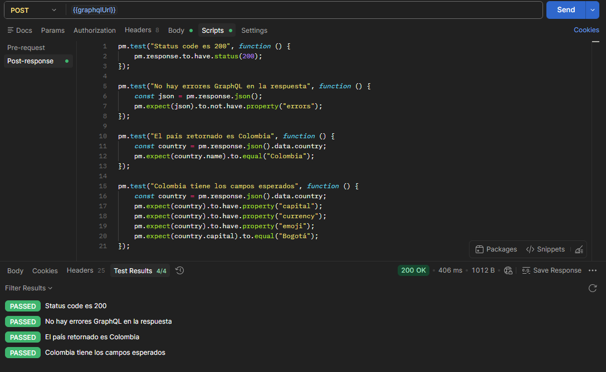
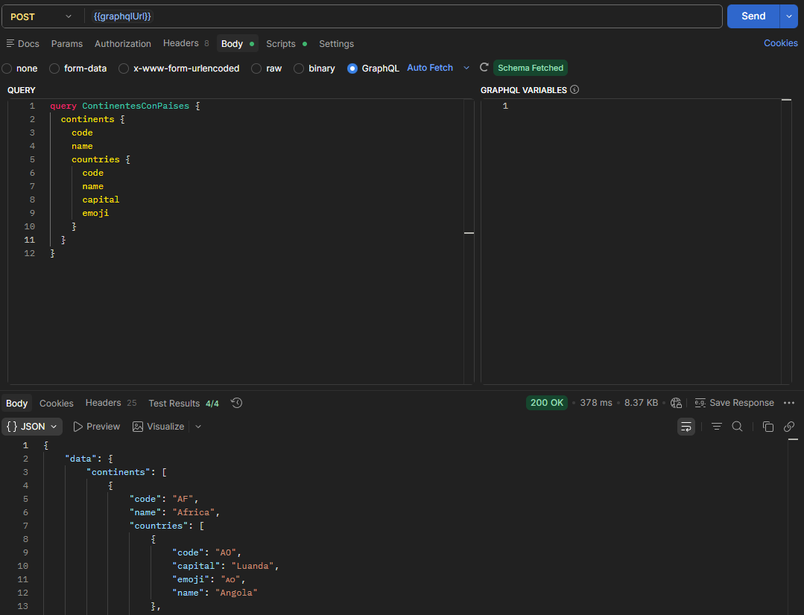
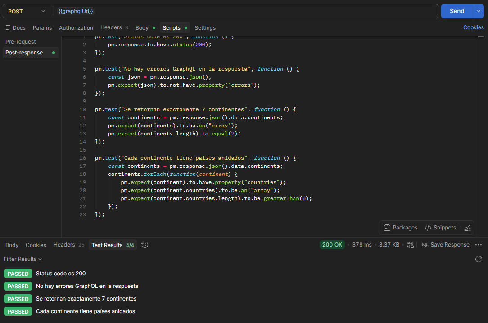
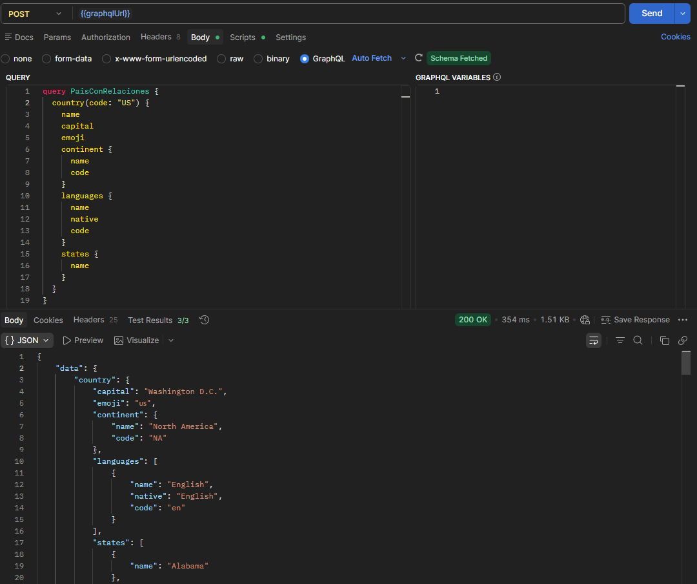
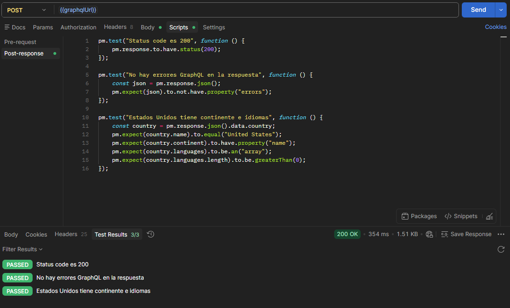
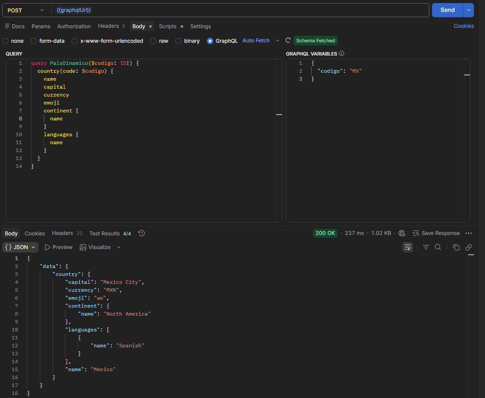
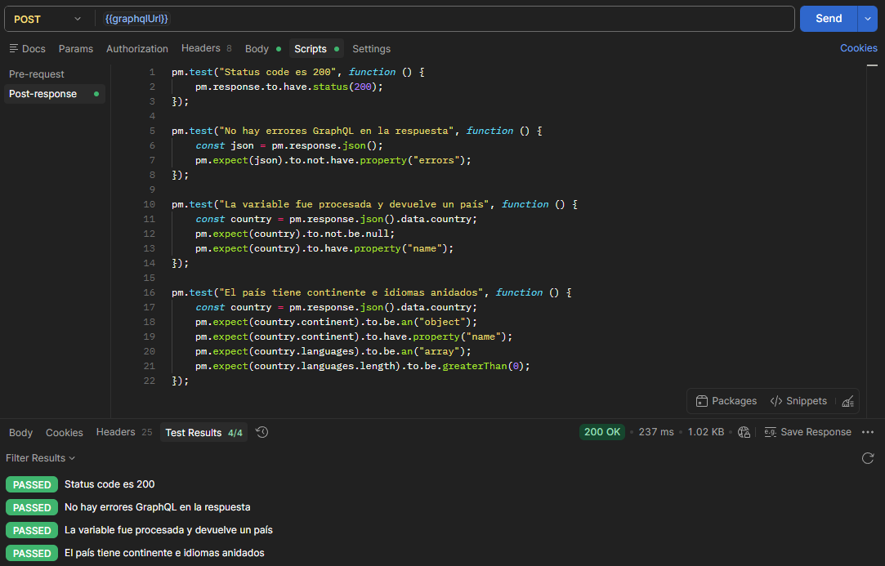

## ¿Qué diferencia encontré vs REST?

| Característica | REST | GraphQL |
|---|---|---|
| Endpoints | Uno por recurso (/character, /episode) | Un solo endpoint para todo |
| Datos recibidos | Los que la API decide | Los que yo pido |
| Código de error | 404, 500, etc. | Siempre 200, errores en el body |
| Overfetching | Recibes campos que no necesitas | Recibes solo lo que pediste |

## ¿Cuántos requests REST necesitaría para mi query más compleja?

Mi query más compleja fue `PaisConRelaciones`, que en un solo request trajo:
- Datos del país → 1 request REST
- Su continente → 1 request REST adicional  
- Sus idiomas → 1 request REST adicional
- Sus estados/departamentos → 1 request REST adicional

**Total: 4 requests REST = 1 query GraphQL**

## ¿En qué proyecto real usaría GraphQL?

Una app móvil de viajes donde el usuario consulta países,
sus idiomas, moneda y clima. En mobile, cada request extra
consume batería y datos. GraphQL reduciría 4 llamadas a 1,
mejorando el rendimiento y la experiencia del usuario.

## Capturas

**Query - Todos los países**

**Tests Query - Todos los países**

**Query - País por código**

**Tests Query - País por código**

**Query - Continentes con países**

**Tests Query - Continentes con países**

**Query - Anidada País con continente e idiomas**

**Tests Query - Anidada País con continente e idiomas**

**Query - Con variables País dinámico**

**Tests Query - Con variables País dinámico**

