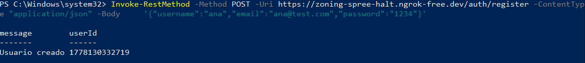
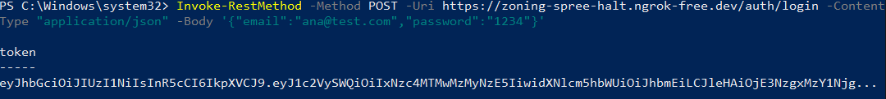
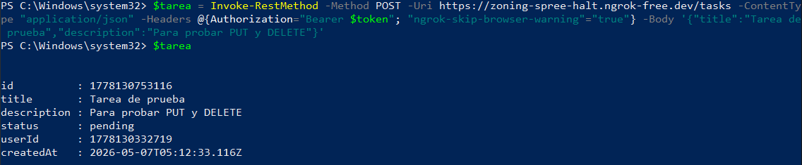
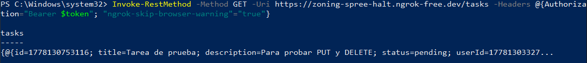
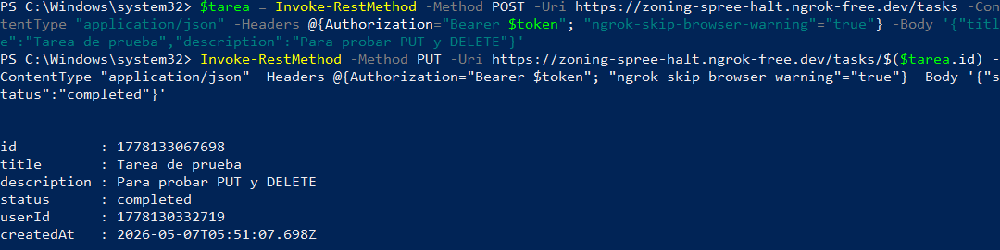
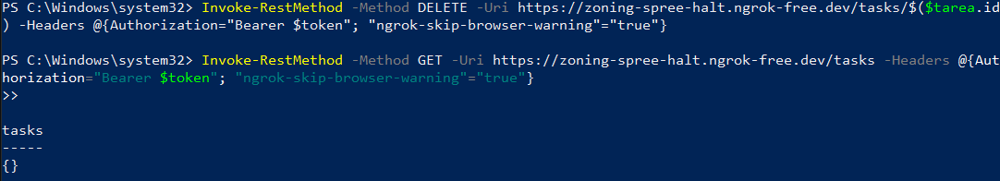
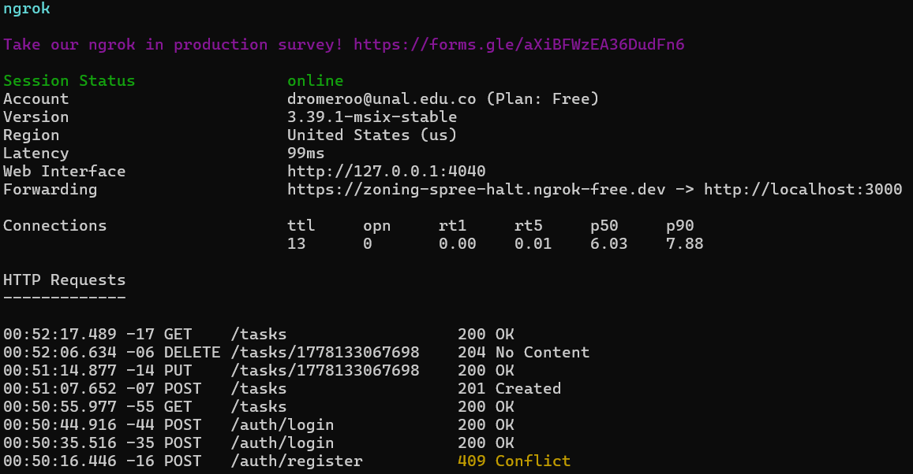

# Laboratorio SSH

**Diego Alberto Romero Olmos**

Este laboratorio hace parte de la materia de ingenieria de software II. La idea era entender cómo funciona la autenticación con JWT implementando una API REST en Node.js puro, sin dependencias externas, y luego consumirla tanto localmente como desde otro equipo.

## Contexto

El servidor está escrito en Node.js usando solo el módulo `http` nativo. No hay Express, no hay librerías de JWT, todo está implementado a mano con `crypto`. Eso lo hace interesante porque obliga a entender qué está pasando por debajo cuando uno normalmente instala `jsonwebtoken` y llama `jwt.sign()` sin pensar.

La API expone seis endpoints: registro, login, y las cuatro operaciones sobre tareas (GET, POST, PUT, DELETE). Las tareas viven en memoria, así que se pierden cada vez que se reinicia el servidor.

## Cómo correr el servidor

```bash
node server.js
```

El servidor queda escuchando en `http://localhost:3000`. Para exponer el servidor al exterior se usó ngrok:

```bash
ngrok http 3000
```

Eso genera una URL pública tipo `https://zoning-spree-halt.ngrok-free.dev` que fue la que se usó desde el PC cliente.

---

## Fase 1 — Registro y login

Lo primero fue registrar un usuario y luego hacer login para obtener el token. El token se guarda en la variable `$token` para reutilizarlo en los requests siguientes.

```powershell
Invoke-RestMethod -Method POST -Uri http://localhost:3000/auth/register `
  -ContentType "application/json" `
  -Body '{"username":"ana","email":"ana@test.com","password":"1234"}'

$token = (Invoke-RestMethod -Method POST -Uri http://localhost:3000/auth/login `
  -ContentType "application/json" `
  -Body '{"email":"ana@test.com","password":"1234"}').token
```





---

## Fase 2 — Crear una tarea (POST)

Con el token guardado se puede crear tareas. La tarea también se guarda en `$tarea` para poder usar su `id` en los pasos siguientes sin tener que copiarlo a mano.

```powershell
$tarea = Invoke-RestMethod -Method POST -Uri http://localhost:3000/tasks `
  -ContentType "application/json" `
  -Headers @{Authorization="Bearer $token"} `
  -Body '{"title":"Tarea de prueba","description":"Para probar PUT y DELETE"}'

$tarea
```



---

## Fase 3 — Listar tareas (GET)

Antes de continuar con PUT y DELETE se lista para confirmar que la tarea quedó creada.

```powershell
Invoke-RestMethod -Method GET -Uri http://localhost:3000/tasks `
  -Headers @{Authorization="Bearer $token"}
```



---

## Fase 4 — Actualizar tarea (PUT)

Se actualiza el `status` de la tarea a `completed`. El servidor verifica que el `userId` del token coincida con el `userId` de la tarea, así que no es posible modificar tareas de otros usuarios.

```powershell
Invoke-RestMethod -Method PUT -Uri http://localhost:3000/tasks/$($tarea.id) `
  -ContentType "application/json" `
  -Headers @{Authorization="Bearer $token"} `
  -Body '{"status":"completed"}'
```



---

## Fase 5 — Eliminar tarea (DELETE)

El DELETE devuelve un 204 sin body, así que en PowerShell no aparece nada en pantalla. Para confirmar que se eliminó se hace un GET después.

```powershell
Invoke-RestMethod -Method DELETE -Uri http://localhost:3000/tasks/$($tarea.id) `
  -Headers @{Authorization="Bearer $token"}

Invoke-RestMethod -Method GET -Uri http://localhost:3000/tasks `
  -Headers @{Authorization="Bearer $token"}
```



---

## Fase 6 — Conexión remota con ngrok

Como uno de los PCs solo tenía WiFi y el otro solo Ethernet, no era posible conectarlos directamente a la misma red. La solución fue usar ngrok para exponer el servidor a internet y consumirlo desde el otro equipo con la URL pública.

El header `ngrok-skip-browser-warning` es necesario porque ngrok en el plan gratuito intercepta las requests con una página de advertencia antes de redirigirlas. Sin ese header devuelve HTML en vez del JSON del servidor.

```powershell
$token = (Invoke-RestMethod -Method POST `
  -Uri https://zoning-spree-halt.ngrok-free.dev/auth/login `
  -ContentType "application/json" `
  -Headers @{"ngrok-skip-browser-warning"="true"} `
  -Body '{"email":"ana@test.com","password":"1234"}').token

$tarea = Invoke-RestMethod -Method POST `
  -Uri https://zoning-spree-halt.ngrok-free.dev/tasks `
  -ContentType "application/json" `
  -Headers @{Authorization="Bearer $token"; "ngrok-skip-browser-warning"="true"} `
  -Body '{"title":"Tarea de prueba","description":"Para probar PUT y DELETE"}'

Invoke-RestMethod -Method PUT `
  -Uri https://zoning-spree-halt.ngrok-free.dev/tasks/$($tarea.id) `
  -ContentType "application/json" `
  -Headers @{Authorization="Bearer $token"; "ngrok-skip-browser-warning"="true"} `
  -Body '{"status":"completed"}'

Invoke-RestMethod -Method DELETE `
  -Uri https://zoning-spree-halt.ngrok-free.dev/tasks/$($tarea.id) `
  -Headers @{Authorization="Bearer $token"; "ngrok-skip-browser-warning"="true"}
```



---

## Preguntas del laboratorio

Estas preguntas vienen del archivo `decodificar.js` y son para reflexionar sobre lo que se vio en el lab.

**¿Qué información viaja en el Header?**
El header del JWT contiene el algoritmo de firma (`HS256`) y el tipo de token (`JWT`). No es información sensible, sirve para que el receptor sepa cómo verificar la firma.

**¿Los datos del Payload están cifrados o solo codificados en Base64?**
Solo codificados. Base64 no es cifrado, cualquiera puede decodificarlo sin ninguna clave. En el lab se ve claramente cuando el script imprime el `userId` y el `username` directamente desde el token sin necesitar el secreto del servidor. Hay que tener cuidado con qué se mete en el payload por esa razón.

**¿Por qué NO se debe guardar la contraseña en el payload?**
Porque el payload es legible por cualquiera que tenga el token. Si alguien intercepta el token, sea en los logs, en el historial del navegador o en una red sin HTTPS, obtendría la contraseña en texto plano. El token ya autentica al usuario, la contraseña no tiene nada que hacer ahí.

**¿Qué pasa si alguien roba el token? ¿Cómo se mitiga ese riesgo?**
Si alguien roba el token puede hacer requests como si fuera el usuario hasta que el token expire. Por eso los tokens tienen expiración corta (en este lab es 1 hora). Otras mitigaciones son usar HTTPS para que el token no viaje en texto plano, no guardarlo en `localStorage` si hay riesgo de XSS, y usar refresh tokens para renovar la sesión sin pedir las credenciales de nuevo.

**¿Qué diferencia hay entre Base64 (codificación) y AES/RSA (cifrado)?**
Base64 es solo una forma de representar datos binarios en texto. No tiene clave, no es reversible de forma "segura", cualquiera puede decodificar. AES y RSA son algoritmos de cifrado que sí usan claves, y sin la clave correcta no se puede recuperar el contenido original. Son cosas completamente distintas aunque ambas transformen datos a un formato diferente.